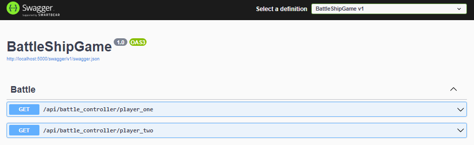
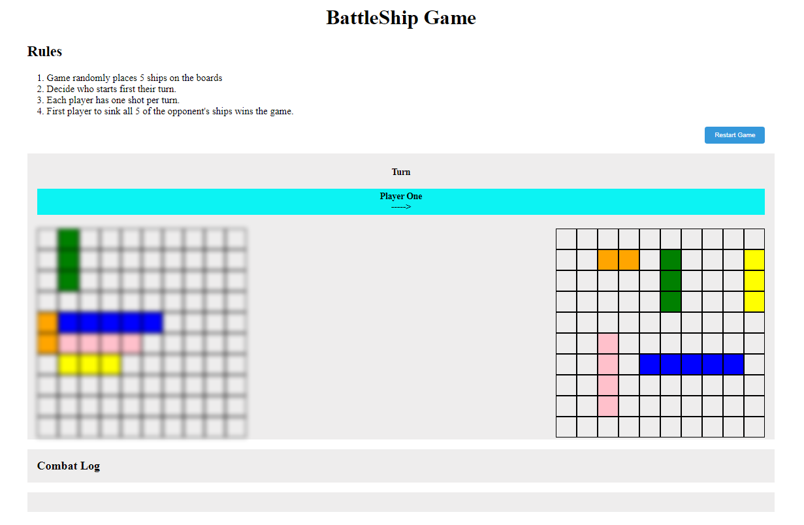
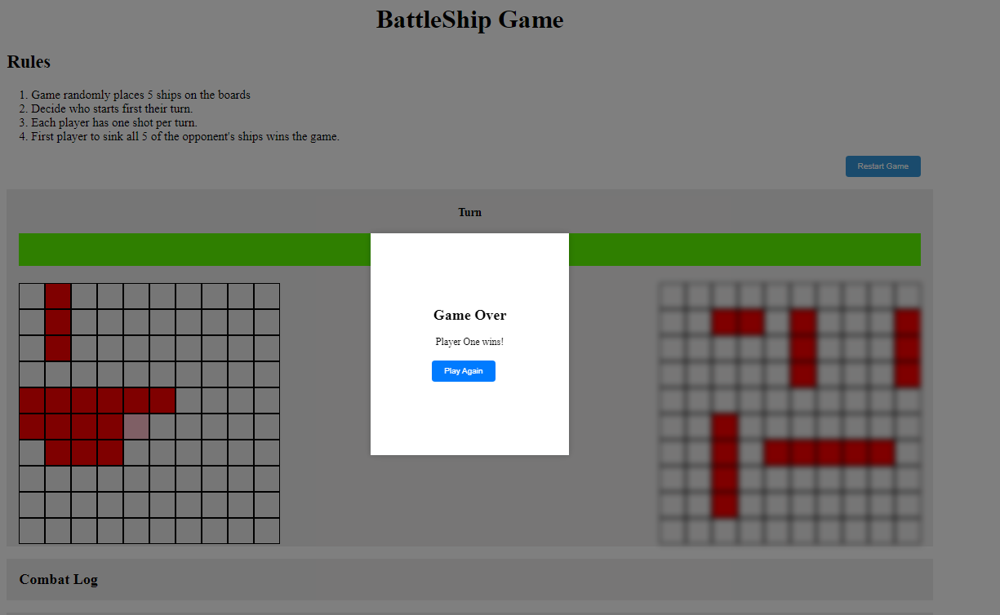

# BattleShipGame

## Introduction
The project focuses on the popular Battle Ship Game, where you and your opponent will alternate turns, calling out one shot per turn to try and hit each other's ships. 

## Getting Started
Project has been made using C# .Net 7.0 and Angular 16.2.

## How it works?
Back-end is implemented with ASP .NET
It has been used for to create API which is responsible for the dynamic and strategic placement of ships on a 10x10 grid board.

Front-end is implemented with Angular and consists of:
- game logic, 
- managing turns, 
- hit-and-miss tracking, and ship destruction.

## How to run project?

To run the .Net API use command in location `/BattleShipGame`:
```bash
$ dotnet run
 ```
 To run the Angular Front-end use command in location `/Client`:
 ```bash
 $ ng serve
 ```

Make sure that in `/Client/src/app/app.component.css` the colors of the ships are commented out, this action will hide them on the boards.

## Photos






## TO DO in future
- Code refactoring,
- Implementing the Player vs Computer
